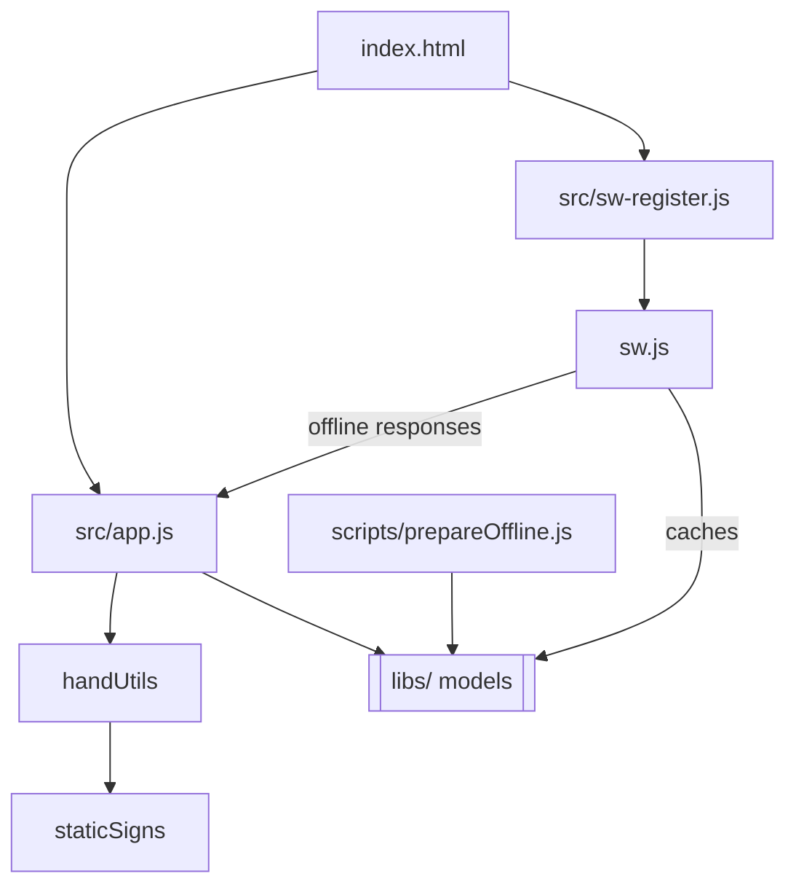

# Application Architecture

This document describes the main modules that compose the SeñAR prototype and how they
interact with each other.

## Core modules

- **`src/app.js`** – Main entry point executed from `index.html`. Sets up the UI,
  initializes MediaPipe trackers and the Whisper speech components, and updates
  captions. It consumes helpers from `handUtils.js` and `staticSigns.js` to
  display recognized letters.
- **`src/staticSigns.js`** – Contains the hand landmark based detection logic for
  static letters A–J. Exported function `detectStaticSign` is used both by
  `handUtils.js` and the main app.
- **`src/handUtils.js`** – Formats the output of `detectStaticSign` for display.
- **`src/sw-register.js`** – Registers the service worker on page load and shows
  an update prompt when a new worker is available.
- **`sw.js`** – Service worker that caches HTML, JS and library files so the app
  works offline. It responds to `fetch` events with cached resources when
  available.
- **`scripts/prepareOffline.js`** – Node script that downloads the MediaPipe and
  Whisper scripts into `libs/` for offline usage, storing a progress file so
  downloads can be resumed. The service worker then caches these files on
  install.

## Interaction overview

The HTML page loads `app.js` along with MediaPipe and other scripts located in
`libs/`. The service worker pre‑caches those assets so the application can run
without network connectivity. `app.js` processes camera frames and formats
recognized hand shapes through `staticSigns.js` and `handUtils.js`. The optional
`prepareOffline.js` script downloads the required models ahead of time so they
are available for the service worker to cache. These models are saved in
`libs/` and cached under the `offline-models` cache, allowing the service worker
to load them when offline.

